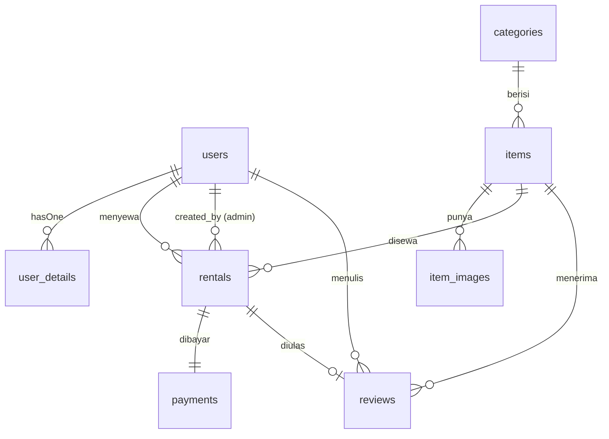

# Database — Skema & Relasi

Dirangkum dari `database/migrations/*` dan `app/Models/*`. DB default: sqlite file
lokal; testing memakai sqlite `:memory:` (`phpunit.xml`).

## 1. Daftar Tabel

### users
Kolom bawaan Fortify/auth (name, email, password, 2FA, remember token) plus:
| Kolom | Tipe | Keterangan |
|---|---|---|
| `role` | string/enum-ish | `admin` / `user` (dipakai `isAdmin()`, `isUser()`) |
| `type` | enum `registered, walk-in`, default `registered` | Membedakan pelanggan mandiri vs walk-in (migrasi `add_type_to_users_table`) |

### user_details (1–1 ke users)
| Kolom | Tipe | Keterangan |
|---|---|---|
| `user_id` | FK → users, cascade | |
| `avatar` | string, nullable | |
| `phone_number` | string unique, nullable | |
| `address` | text, nullable | |
| `identity_card_photo` | string, nullable | Foto KTP (KYC ringan) |

### categories
`id`, `name`, `slug`, timestamps. Relasi: `hasMany items`.

### items
| Kolom | Tipe | Keterangan |
|---|---|---|
| `category_id` | FK → categories, cascade | |
| `name` | string | |
| `description` | text, nullable | |
| `price_per_day` | unsigned int | Satuan harga harian |
| `stock` | unsigned int | Stok total |

### item_images
| Kolom | Tipe | Keterangan |
|---|---|---|
| `item_id` | FK → items, cascade | |
| `path` | string | Disimpan di disk `public`, prefix `items/images/{nama}` |
| `order` | int, default 0 | Urutan tampil (`images()` diurut `order`) |

Maksimal 5 file per item (validasi `ItemController@store`), format
jpeg/png/jpg/gif/svg ≤ 2 MB.

### rentals
| Kolom | Tipe | Keterangan |
|---|---|---|
| `user_id` | FK → users, cascade | Penyewa |
| `item_id` | FK → items, cascade | |
| `quantity` | int, default 1 | Ditambah belakangan (`add_quantity_to_rentals_table`) |
| `start_date` / `end_date` | date | Rentang sewa (cast `date`) |
| `price_per_day` | decimal 10,2 | Snapshot harga saat transaksi |
| `total_days` | int | `diffInDays(end, start)` |
| `total_price` | decimal 10,2 | `price_per_day × total_days` |
| `status` | enum, default `ditunda` | `ditunda, disetujui, berjalan, selesai, ditolak, dibatalkan` |
| `notes` | text, nullable | |
| `created_by` | FK → users, nullable, set null | Admin yang menginputkan (walk-in) |

Relasi: `belongsTo user/item/createdBy`, `hasOne payment/review`.

### payments
| Kolom | Tipe | Keterangan |
|---|---|---|
| `rental_id` | FK → rentals, cascade | Satu payment per rental (hasOne) |
| `amount` | unsigned int | Harus = `rentals.total_price` (aturan bisnis, belum divalidasi) |
| `payment_method` | string | Metode transfer manual |
| `proof_of_payment` | string | Path bukti transfer (wajib) |
| `status` | enum, default `ditunda` | `ditunda, disetujui, ditolak` |

### reviews
| Kolom | Tipe | Keterangan |
|---|---|---|
| `user_id` / `item_id` / `rental_id` | FK, cascade | Satu ulasan per rental |
| `rating` | int | |
| `comment` | text, nullable | |

## 2. ERD (Mermaid)

## 3. Temuan Inkonsistensi (jangan dianggap sepele)

1. `rentals.quantity` ada di DB (default 1) tetapi **tidak ada di `$fillable`
   maupun perhitungan harga** — `getTotalPrice()` hanya `price × days`,
   quantity diabaikan. Putuskan: libatkan quantity dalam total atau hapus kolom.
2. `payments.status` ada di migrasi tetapi **tidak ada di `$fillable` Payment**
   — status tidak bisa di-mass-assign; update status harus di-assign manual.
3. `rentals.price_per_day` (decimal) vs `items.price_per_day` (unsigned int) —
   tipe tidak konsisten; snapshot desimal vs master integer.
4. Tidak ada constraint unik `payments.rental_id` / `reviews.rental_id` di level DB;
   relasi satu-ke-satu hanya dijaga di level aplikasi (belum ada validasinya).
5. Tidak ada pengecekan overlap tanggal vs stok — double-booking dimungkinkan.
6. `down()` pada migrasi `add_type_to_users_table` dan
   `add_quantity_to_rentals_table` kosong — rollback tidak menghapus kolom.
7. Seeder hanya membuat 2 user (`DatabaseSeeder`); factory lain
   (Rental, Payment, Review, Item, dsb.) masih kosong — seeding development
   minim.

## 4. Konvensi

- Hapus user/item/rental merambat (cascade); penghapus admin pada
  `rentals.created_by` di-set null agar riwayat tidak hilang.
- Foto item dan bukti bayar tersimpan di disk `public`; pastikan
  `php artisan storage:link` saat setup environment baru.
